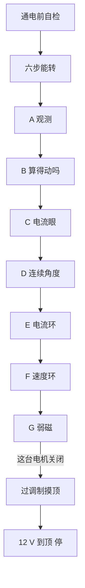

# 1. 电机控制程序调试路线图

控制程序不是一上来就「闭环转起来」。后面每一步都在用前面做出的眼睛。跳步会把硬件故障、测量作废和算法错误搅在一起。

## 台上是什么

- 电机：小无刷，三相，4 极对，相间 1.3 Ω。霍尔在三个引脚上。
- 驱动：三块半桥板，12 V（后试过 15 V）。
- 芯片：STM32F030，48 MHz，**没有浮点运算器**，Flash 32 KB、RAM 4 KB。
- 负载：Mobac 520P 磁粉制动器。旋钮刻度 0–5 对应大约 0–14%，力矩**不是线性的**，膝盖在 3→4。
- 成绩：转速看 wrap（芯片记下的净电角度 ÷ 电脑秒表）。电流看三相 ADC。母线另有电流表和板上分压。

## 为什么必须按这个顺序

没有观测，你分不清「电机没力」和「你读到的是假数」。没有电流眼，角度对不准。角度不对就闭环，电流会打进不该打的方向。电流环不稳，速度环调的是噪声。电压还没顶死，弱磁是在减力矩，不是在加速。

## 各阶段一句话

| 阶段 | 要证明的事 | 结果 |
|---|---|---|
| 自检 | 探头在、12 V 在、CPU 在跑、电源没限流、电机接上了 | 每次通电的固定开头。空载母线约 4 mA |
| 六步 | 功率级和霍尔映射能转 | 回归基准。duty 20% 大约 60–70 mA、24 电周期/秒。出问题先退回这里 |
| A 观测 | 能从芯片里拿出连续波形，能数清一拍要多少时间 | RAM 环形缓冲 + 周期数台架。Hall 六个扇区本来就不等宽 |
| B 算得动吗 | 这份算法在 20 kHz 里放不放得下 | 浮点放不下。手写定点 Hall-FOC，**不刷** Simulink 生成的 C |
| C 电流眼 | ADC 读的是绕组电流，不是开关噪声 | 1.617 mA/一格，零点钉在 2048。低边导通时才采得到 |
| D 连续角度 | 霍尔边沿之间能外推出平滑电角度 | 边沿跳变约 1°。绝对零点留给电流环用 id 标定 |
| E 电流环 | id 压到 0，iq 跟着指令走 | 已验收。仍由六步先转起来再交接，不是从零无感起转 |
| F 速度环 | 指定转速能抱住，加减载能拉回 | 80 / 130 两向抱住。80→130 大约 300 ms。力矩曲线、电压顶都量过 |
| G 弱磁 | 电压顶死后，负 id 还能不能再快 | **关闭。** 特征电流 14.4 A，台架大约 3 A，没有恒功率区 |
| 过调制 | 超出正圆、用到六边形电压 | 12 V 刻度 4 最快大约 wrap **188**。15 V 大约 **213**。再快要加电压或减载 |

## 现在停在哪（2026-09-15）

阶段 A–F 交差，G 关闭。过调制的积分回灌已修好，不再猎振。

在这台电机、这套半桥、刻度 4 上，**控制算法能挖的已经挖完**。12 V 上 PWM 打满、电流指令再加也不转得更快；大约 150 电周期/秒以上低边采样窗口没了，电流反馈作废，FOC 实际上已是电压控制。15 V 立刻更快，说明卡的是电压，不是软件。

还没做的温升长跑、从零启动、把扰动做成可重复实验，都是填表，不改变上限。

## 明确不要再做的

- 弱磁 / 负 id 抬转速
- 再扫采样提前量（窗口已经是零）
- 把 `n/2` 加回转速计算
- 同一电压上限上再比「过调制是否更快」
- 把 MATLAB 里用未测转动惯量算出来的速度环增益，当成芯片上的环

下一步若还碰这套台架：扰动实验做干净，或把 `pcb/` 另开任务进 Git。不要再为了 12 V 转速通电。
